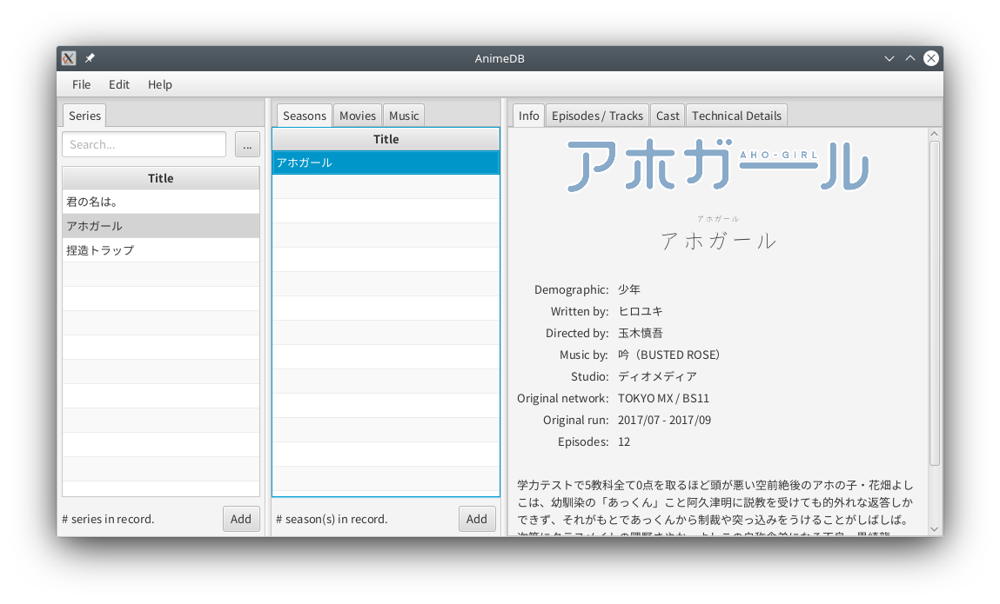
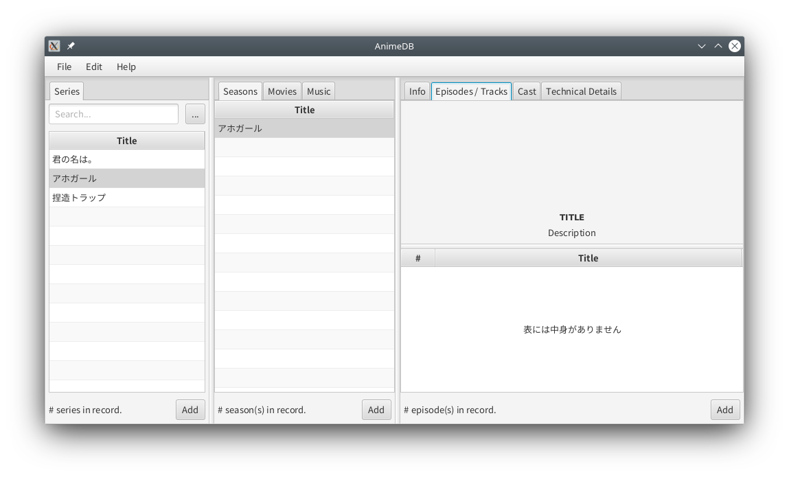
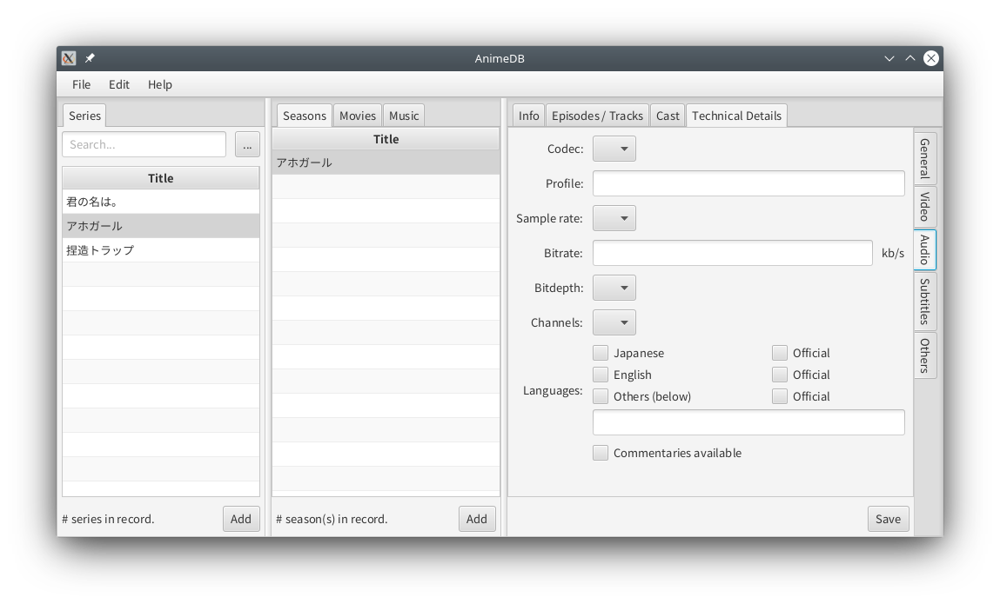

# AnimeDB

**Warning:** AnimeDB is a work in progress and while the master branch is probably buildable,
that doesn't mean building it will result in a usable software.

**Current state:** The interface (not final) is able to show but currently, the application doesn't do anything.

AnimeDB is a work-in-progress software to manage your anime (and even anime soundtrack and OVA/movies) collection.

This software supports both Japanese and English natively, allowing you to store information in both languages
simultaneously, so season information can be shown in your desired language in the flick of a switch. Titles, synopsis,
character names and staff names, among others, can be recorded in either language simultaneously and shown in either
language.

## Anime organization

This will allow you to organize them according to series, seasons, and episodes, including other related data
such as soundtracks, OVAs, movies. Soundtracks are categorized with albums and tracks, too.

This software can manage details such as:

* General season information including demographics, writer, director, composer, studio, TV network,
  broadcast dates, and especially synopsis
* Episode screenshots, synopsis, title
* Voice actors and crew (such as art director, etc), including their photos

It also supports jaw-droppingly extensive metadata management, including:

* Anime source (whether you downloaded it from somewhere or you ripped it yourself)
* Whether it is fansubbed or raw
* Container format (MKV, MP4, whatever it may be)
* Overall bitrate
* Video codec, profile, resolution, framerate, bitrate, postprocessing info
* Audio codec, profile, sampling rate, bitrate, bitdepth, channels, available languages, commentaries
* Subtitles codec, languages, hard-coded info
* Downloaded date, download source, personal notes

## Anime playback

Play seasons or episodes with one simple click, monitor which episodes have already been watched.

Search for seasons or episodes using various data.

## Screenshots

### Main screen

### Episode list

### Technical metadata

